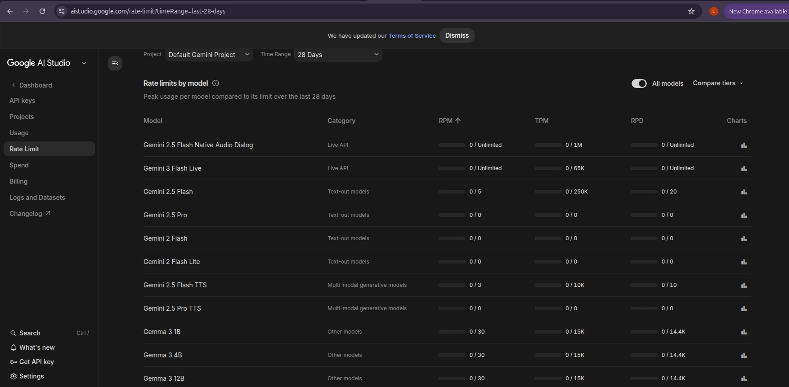
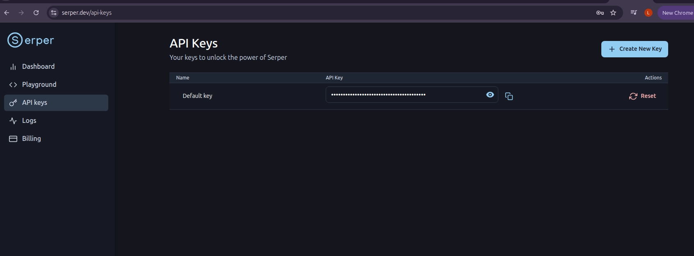
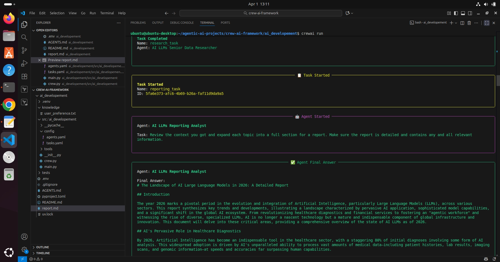
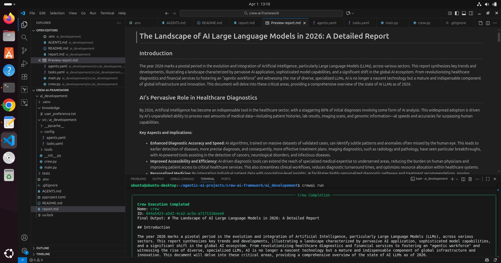
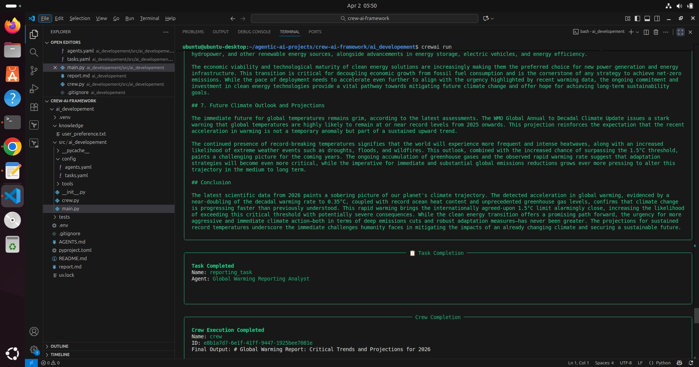

## What are we building?

In this project, you are building an **AI system with multiple agents** that:

- Research a topic (like a human researcher)
- Analyze the data (like an analyst)
- Generate a full report (like a writer)

This is called an **Agentic AI system**.

👉 Instead of 1 AI doing everything, we create **multiple specialized AI agents**.

## Concept Explanation Step by step

---

### 1: Install Tools

The video shows:

- Python
- UV
- CrewAI

👉 Purpose:

To set up environment for AI agents

---

### 2: Generate Project

```
crewai create crew ai-developement
```

👉 This creates:

- Agents config
- Tasks config
- Main execution file

---

### 3: Choose LLM Provider

You selected:

👉 Gemini

---

### 4: Define Agents

From tutorial concept:

> Agents are autonomous systems that can reason, act, and use tools
> 

---

### 👇 In your project:

### Researcher Agent

- Finds information
- Uses internet (Serper)

### Reporting Agent

- Converts data → report

---

### 5: Define Tasks

This is very important.

👉 Tasks tell agents:

- What to do
- Expected output format

---

### Example from our project:

### Task 1:

👉 Research topic

### Task 2:

👉 Generate report

---

### 6: Add Tools

> Tools allow agents to perform real-world actions like searching or fetching data
> 

---

### In our case:

```
SerperDevTool
```

👉 Gives agent ability to:

- Search Google
- Get real-time data

---

### 7: Execution Flow

This is what video actually demonstrates:

---

### Flow:

1. User gives input
    
    ```
    topic = AI LLMs
    ```
    
2. Research Agent:
    - Uses Serper
    - Collects info
3. Passes data ➡️
4. Reporting Agent:
    - Expands info
    - Creates structured report
5. Output:
    
    ```
    report.md
    ```
    

---

## What makes this “Agentic AI”?

👉 Not hardcoded logic

Instead:

- AI decides
- AI uses tools
- AI collaborates

# Implementation

## Step 1: Prerequisites

### Check Python version

```
python3--version
```

You need Python installed (preferably 3.10+).

## Step 2: Install UV (Modern Python Package Manager)

👉 UV is a fast alternative to pip.

### Install using curl:

```
curl-LsSf https://astral.sh/uv/install.sh |sh
```

### OR using wget:

```
wget-qO- https://astral.sh/uv/install.sh |sh
```

### Verify installation:

```
uv self version
```

## Step 3: Install CrewAI

CrewAI is the framework that helps you build AI agents.

```
uv tool install crewai
```

Check installed tools:

```
uv tool list
```

> [!NOTE]
>
>### Upgrade if needed:
>
>```
>uv tool install crewai--upgrade
>```

## Step 4: Create Your AI Project

```
crewai create crew ai-developement
```

👉 This creates a **ready-made project structure (boilerplate)**.

## Step 5: Choose AI Provider

You’ll see options like:

It asks you about the provider to choose:

```bash
Creating folder ai_developement...
Cache expired or not found. Fetching provider data from the web...
Downloading  [####################################]  1329442/67868
Select a provider to set up:
1. openai
2. anthropic
3. gemini
4. nvidia_nim
5. groq
6. huggingface
7. ollama
8. watson
9. bedrock
10. azure
11. cerebras
12. sambanova
13. other
q. Quit
```

I am going to choose gemini: `3`

If you api keys for other model then choose the provider accordingly.

Gemini provides some free usage for API keys so only i choose gemini.

## Step 6: Choose a Model

Choose:

```
gemini/gemini-2.5-flash
```

If dont find the model then select any random one, we can replace it later in the `env` file, Or skip the step.

```bash
Enter the number of your choice or 'q' to quit: 3
Select a model to use for Gemini:
1. gemini/gemini-3-pro-preview
2. gemini/gemini-1.5-flash
3. gemini/gemini-1.5-pro
4. gemini/gemini-2.0-flash-lite-001
5. gemini/gemini-2.0-flash-001
6. gemini/gemini-2.0-flash-thinking-exp-01-21
7. gemini/gemini-2.5-flash-preview-04-17
8. gemini/gemini-2.5-pro-exp-03-25
9. gemini/gemini-gemma-2-9b-it
10. gemini/gemini-gemma-2-27b-it
11. gemini/gemma-3-1b-it
12. gemini/gemma-3-4b-it
13. gemini/gemma-3-12b-it
14. gemini/gemma-3-27b-it
q. Quit
```

> [!TIP]
>
># Why we are using *Gemini 2.5 Flash*
>
>👉 *“Why specifically this model?”*
>
>Let’s break it down simply.
>
>---
>
>## 1. What is Gemini 2.5 Flash?
>
>It is a **lightweight, fast, and cheaper AI model** from Google.
>
>👉 Think of models like this:
>
>| Model Type | Example | Purpose |
>| --- | --- | --- |
>| Heavy model | Gemini Pro | Deep reasoning |
>| Fast model | Gemini Flash | Quick tasks |
>
>---
>
>## 2. Why used in this project?
>
>Your project = **multi-agent system**
>
>That means:
>
>- Multiple agents ❗
>- Multiple API calls ❗
>- Continuous execution ❗
>
>---
>
>### Problem if you use heavy model (Pro)
>
>- ❌ Slow response
>- ❌ Expensive
>- ❌ Rate limits hit quickly
>- ❌ Overkill for simple tasks
>
>---
>
>### Why Flash is perfect here
>
>### 1. Speed (MOST IMPORTANT)
>
>Agents need to:
>
>- Think
>- Call tools
>- Pass outputs
>
>👉 Flash is optimized for **fast responses**
>
>---
>
>### 2. Cost-efficient
>
>Multi-agent = many API calls
>
>👉 Flash = cheaper → sustainable
>
>---
>
>### 3. Good enough intelligence
>
>Your tasks:
>
>- Research
>- Summarize
>- Generate report
>
>👉 These don’t need super-deep reasoning
>
>---
>
>### 4. Works well with tools
>
>Your agent uses:
>
>- Serper (search tool)
>
>👉 Flash handles:
>
>- Tool calling
>- Data summarization
>efficiently
>
>And the main reason to use it:
>
>Because:
>
>1. It exists in our quota (free usage) ✅
>2. It has non-zero limits ✅
>3. It supports `generateContent` ✅
>4. Your API key is authorized for it ✅
>
>---
>
>
>

## Step 7: Add API Keys

### Gemini API Key

Get it from:

Head to [`https://aistudio.google.com/`](https://aistudio.google.com/)  Sign up and generate the API keys

[`https://aistudio.google.com/api-keys`](https://aistudio.google.com/api-keys)

---

Get the api key from gemini and paste that here:

You can skip that for now and configure later also, in my case i will give that right now

```bash
Enter the number of your choice or 'q' to quit: 2
Enter your GEMINI API key from https://ai.dev/apikey (press Enter to skip): 
```

After pasting the api key it creates these files:

```bash
API keys and model saved to .env file
Selected model: gemini/gemini-1.5-flash
  - Created ai_developement/.gitignore
  - Created ai_developement/pyproject.toml
  - Created ai_developement/README.md
  - Created ai_developement/knowledge/user_preference.txt
  - Created ai_developement/src/ai_developement/__init__.py
  - Created ai_developement/src/ai_developement/main.py
  - Created ai_developement/src/ai_developement/crew.py
  - Created ai_developement/src/ai_developement/tools/custom_tool.py
  - Created ai_developement/src/ai_developement/tools/__init__.py
  - Created ai_developement/src/ai_developement/config/agents.yaml
  - Created ai_developement/src/ai_developement/config/tasks.yaml
Crew ai-developement created successfully!
```

cd to the project just now created:

```bash
cd ai_developement
```

## Step 8: Understand Project Structure

When created, you get:

```
ai_developement/
├── .env
├── src/
│   ├── main.py
│   ├── crew.py
│   ├── config/
│   │   ├── agents.yaml
│   │   ├── tasks.yaml
│   ├── tools/
```

---

## Step 9: Understanding AI Agents

## `agents.yaml`

This defines **WHO your agents are**

### Example:

```
researcher:
  role: {topic} Senior Data Researcher
  goal: Uncover cutting-edge developments
```

👉 This means:

- The agent behaves like a **research expert**
- `{topic}` is dynamic (comes from code)

---

### Concept:

Agents have:

- **Role** → Who they are
- **Goal** → What they must achieve
- **Backstory** → Personality (improves AI behavior)

---

## Step 10: Define Tasks

## `tasks.yaml`

This defines **WHAT agents do**

```
research_task:
  description: Research {topic}
  expected_output: 10 bullet points
```

```
reporting_task:
  description: Create detailed report
```

---

### Flow:

1. Researcher → gathers data
2. Analyst → creates report

in the root directory of the project there is an `env`  file created automatically in that the `model`  and the `api key` stored.

## Step 11: Add Tools

👉 Agents need tools to interact with the world.

Without tools = AI is blind ❌

---

### Serper API Key (for internet access)

👉 Think of Serper as:

> “Google Search for your AI agents”
> 

It allows agents to fetch real-time data.

Get it from:

👉 [https://serper.dev](https://serper.dev/)

Sign up with basic informations.

Once email verfication is done you get the api key



---

### Update `.env` file in the project root

You can change the `API keys` and `model`here

```
MODEL=gemini/gemini-2.5-flash
GEMINI_API_KEY=your_key_here
SERPER_API_KEY=your_key_here
```

For example:

```bash
MODEL=gemini/gemini-1.5-flash
GEMINI_API_KEY=AIzaSyAB-RN6U***********2tRcQGJcGzqVNY9A
SERPER_API_KEY=ca***************775908cdc819cfe80598458
```

### Add Serper Tool

In `crew.py`:

```
fromcrewai_tools import SerperDevTool
```

Assign it:

```
@agent
defresearcher(self) ->Agent:
returnAgent(
config=self.agents_config['researcher'],
verbose=True,
tools=[SerperDevTool()]
    )
```

👉 Now your agent can:

- Search Google
- Fetch real-time info

Now lets go and review the agents yaml file inside `src/ai_developement/config` 

This is where we can actually modify the prompts and anything that we need to make sure that it matches the way we want the agents to act in this case.

The topic you see within `{}`  it refernce to the `main.py`  functions `run, train and test` in `src/ai_developement`  path.

So the agent get full context of its role. you can modify the the topic in the functions in `main.py` 

Currently its set to `AI LLMs` .

```python
def run():
    """
    Run the crew.
    """
    inputs = {
        'topic': 'AI LLMs',
        'current_year': str(datetime.now().year)
    }

    try:
        AiDevelopement().crew().kickoff(inputs=inputs)
    except Exception as e:
        raise Exception(f"An error occurred while running the crew: {e}")
```

> [!NOTE]
>
>Its very important how would you craft your prompts to make sure that it actually matches your intent and what you want the agent to perform
>

The same goes for the `reporting_analysis` as well

```yaml
researcher:
  role: >
    {topic} Senior Data Researcher
  goal: >
    Uncover cutting-edge developments in {topic}
  backstory: >
    You're a seasoned researcher with a knack for uncovering the latest
    developments in {topic}. Known for your ability to find the most relevant
    information and present it in a clear and concise manner.

reporting_analyst:
  role: >
    {topic} Reporting Analyst
  goal: >
    Create detailed reports based on {topic} data analysis and research findings
  backstory: >
    You're a meticulous analyst with a keen eye for detail. You're known for
    your ability to turn complex data into clear and concise reports, making
    it easy for others to understand and act on the information you provide.
```

in the `task.yaml`  you give the task you wants to perform by the agents

`task.yaml`

```yaml
research_task:
  description: >
    Conduct a thorough research about {topic}
    Make sure you find any interesting and relevant information given
    the current year is {current_year}.
  expected_output: >
    A list with 10 bullet points of the most relevant information about {topic}
  agent: researcher

reporting_task:
  description: >
    Review the context you got and expand each topic into a full section for a report.
    Make sure the report is detailed and contains any and all relevant information.
  expected_output: >
    A fully fledged report with the main topics, each with a full section of information.
    Formatted as markdown without '```'
  agent: reporting_analyst
```

## Step 12: Install Dependencies

Make sure you are on the right directory

```python
~/agentic-ai-projects/crew-ai-framework/ai_developement$ ls
AGENTS.md  knowledge  pyproject.toml  README.md  src  tests
```

```
crewai install
```

This creates:

```
uv.lock
```

👉 Locks dependency versions (important for consistency)

We are ready to run the crew now.

## Step 13: Run the Project

```
crewai run
```

---

### What Happens Internally?

1. Inputs passed (`topic`)
2. Research agent starts
3. Uses Serper tool
4. Collects data
5. Passes to analyst agent
6. Analyst creates report
7. Output saved as:

```
report.md
```

If you get some error like dependency not installed then you can install the below.

```python
uv add "crewai[google-genai]"
```





## Step 14: Test with Different Topics

Modify `main.py`:

```
inputs= {
'topic':'Global Warming',
'current_year':'2026'
}
```

For Example:

`main.py`

```python
#!/usr/bin/env python
import sys
import warnings

from datetime import datetime

from ai_developement.crew import AiDevelopement

warnings.filterwarnings("ignore", category=SyntaxWarning, module="pysbd")
from crewai_tools import SerperDevTool

# This main file is intended to be a way for you to run your
# crew locally, so refrain from adding unnecessary logic into this file.
# Replace with inputs you want to test with, it will automatically
# interpolate any tasks and agents information

def run():
    """
    Run the crew.
    """
    inputs = {
        'topic': 'Global Warming',
        'current_year': str(datetime.now().year)
    }

    try:
        AiDevelopement().crew().kickoff(inputs=inputs)
    except Exception as e:
        raise Exception(f"An error occurred while running the crew: {e}")

def train():
    """
    Train the crew for a given number of iterations.
    """
    inputs = {
        "topic": "Global Warming",
        'current_year': str(datetime.now().year)
    }
    try:
        AiDevelopement().crew().train(n_iterations=int(sys.argv[1]), filename=sys.argv[2], inputs=inputs)

    except Exception as e:
        raise Exception(f"An error occurred while training the crew: {e}")

def replay():
    """
    Replay the crew execution from a specific task.
    """
    try:
        AiDevelopement().crew().replay(task_id=sys.argv[1])

    except Exception as e:
        raise Exception(f"An error occurred while replaying the crew: {e}")

def test():
    """
    Test the crew execution and returns the results.
    """
    inputs = {
        "topic": "Global Warming",
        "current_year": str(datetime.now().year)
    }

    try:
        AiDevelopement().crew().test(n_iterations=int(sys.argv[1]), eval_llm=sys.argv[2], inputs=inputs)

    except Exception as e:
        raise Exception(f"An error occurred while testing the crew: {e}")

def run_with_trigger():
    """
    Run the crew with trigger payload.
    """
    import json

    if len(sys.argv) < 2:
        raise Exception("No trigger payload provided. Please provide JSON payload as argument.")

    try:
        trigger_payload = json.loads(sys.argv[1])
    except json.JSONDecodeError:
        raise Exception("Invalid JSON payload provided as argument")

    inputs = {
        "crewai_trigger_payload": trigger_payload,
        "topic": "",
        "current_year": ""
    }

    try:
        result = AiDevelopement().crew().kickoff(inputs=inputs)
        return result
    except Exception as e:
        raise Exception(f"An error occurred while running the crew with trigger: {e}")

```

Run again:

```
crewai run
```

---

## Step 15: Output

Final result:

```
report.md
```

Contains:

- Structured report
- Multiple sections
- Clean formatting

---

Run:

```python
crewai run
```

Expected output:



Check the `report.md`


Similarly you test with any topic you want.

# Important Concepts

## 1. What is an Agent?

An AI with:

- Role
- Goal
- Tools
- Memory

---

## 2. What is Agentic AI?

👉 Multiple agents working together like a team.

---

## 3. What are Tools?

APIs that agents use:

- Search (Serper)
- Code execution
- APIs

---

## 4. Why Prompt Design Matters?

Better prompts = better output

# Summary

You built:

✔ Multi-agent AI system

✔ With real-time internet access

✔ Using Gemini + CrewAI

✔ That generates structured reports